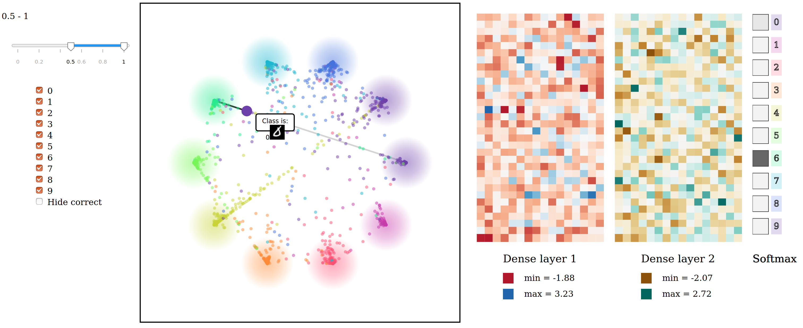
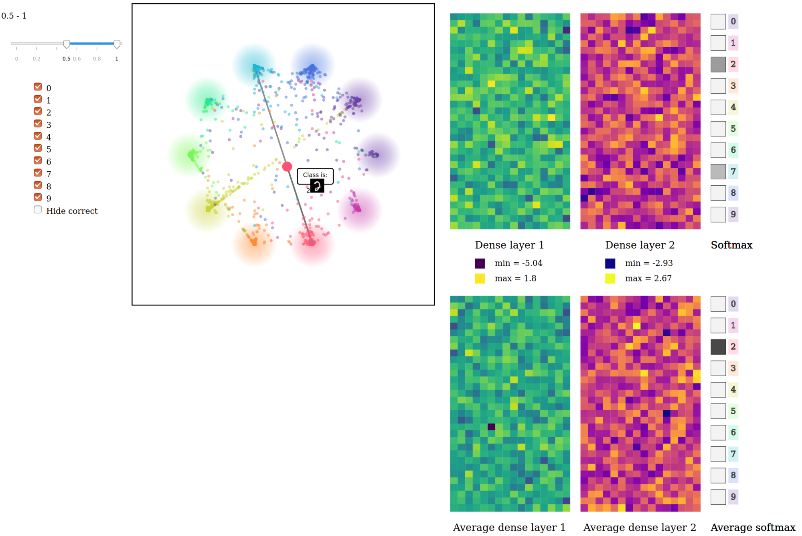

# RainbowVis

Semestral work submitted in the course on visualization. The app allows to visualize activations and outputs from a neural network classifying MNIST digits and therefore to provide a better understanding of the model's behaviour.

The source data will be downloaded automatically and then visualized as points in the square window. For efficient exploration you can use filtering in the left panel or get the precise values by pointing at the tiles in the right panel.

## How to run
1) Install requirements:\
pip install flask pillow numpy wget
2) Run app:\
cd App\
python run.py
3) Open browser (URL is shown in terminal)

## Illustration
Correctly classified input

Incorrectly classified input

