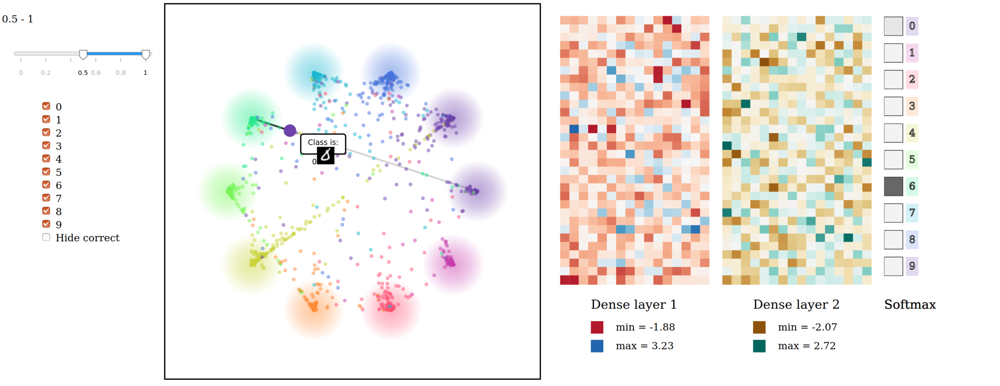

# RainbowVis

Semestral work submitted in the course on visualization. The app allows to visualize 

## How to run
1) pip install flask pillow numpy wget
2) cd App; python run.py
3) Open browser (URL is shown in terminal)

## Illustration

